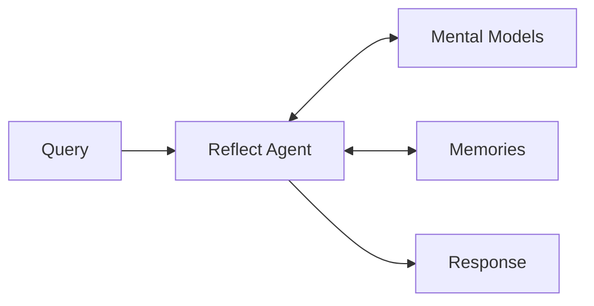

# Introducing mental models

We're excited to announce **Mental Models**, a fundamental redesign of how Hindsight agents form, organize, and evolve their beliefs. This replaces the previous opinions and observations system with a more powerful, evidence-grounded architecture.

<!-- truncate -->

---

## The reflect agent needs more power

When you call `reflect()`, you're asking the agent to reason—not just retrieve facts, but think about them, form judgments, and provide contextual answers. But effective reasoning requires more than raw memories. The agent needs:

- **A sense of purpose**: What is this agent for? What should it pay attention to?
- **Organized knowledge**: Not scattered facts, but structured understanding of key topics
- **Evolving beliefs**: The ability to form, refine, and update views based on accumulated evidence

This is where **Mission** and **Mental Models** come in.

### Mission: defining agent purpose

Every memory bank can now have a **mission**—a natural language description of what the agent is for:

```python
client.set_mission(
    bank_id="pm-agent",
    mission="Be a PM for the engineering team, tracking sprint progress, team capacity, and technical decisions"
)
```

The mission is foundational. It tells the agent:
- What topics are important to track
- How to interpret incoming information
- What kind of mental models to build automatically

Without a mission, the agent has no compass. With one, it knows what matters.

**Note:** A mission is required to use mental models, but mental models themselves are optional. You can still use `reflect()` without setting a mission—the agent will reason over raw memories as before. Mental models add an additional layer of structured understanding on top.

---

## Mental models: structured understanding

Mental models are **organized knowledge containers** that give the Reflect agent a broader, structured understanding of important topics. Instead of reasoning over raw memories alone, the agent can draw on synthesized knowledge about key people, projects, concepts, and decisions.



The agent runs a reasoning loop, deciding which tools to use based on the query. It can explore mental models, search memories, drill into documents, or create new mental models when it discovers important patterns. Each mental model groups observations about a topic with full provenance—the agent doesn't just know something, it knows *why* it knows it.

### What about opinions and observations?

In earlier versions, Hindsight formed beliefs through **opinions** (beliefs with confidence scores) and **observations** (entity-specific patterns). Mental models build on these concepts while adding:

- **Organization**: All observations about a topic grouped together
- **Evidence trail**: Every belief links back to source memories with exact quotes
- **Version history**: Track how beliefs evolve over time

### What's in a mental model?

Each mental model contains:

- **Name**: Human-readable identifier ("Alice", "Tech Stack Decisions")
- **Description**: One-liner for quick scanning
- **Observations**: List of beliefs with evidence
- **Version**: Current version number
- **Tags**: For scoped visibility

### Evidence-grounded observations

Every observation now requires **exact quotes** from source memories:

```json
{
  "title": "Strong ML expertise",
  "content": "Alice has deep machine learning knowledge, particularly in transformer architectures and production ML systems.",
  "evidence": [
    {
      "memory_id": "mem_abc123",
      "quote": "Alice implemented our BERT-based classifier that reduced inference latency by 40%",
      "relevance": "Demonstrates practical transformer expertise",
      "timestamp": "2025-11-15T10:30:00Z"
    },
    {
      "memory_id": "mem_def456",
      "quote": "Alice's talk on production ML pipelines was the highlight of the engineering offsite",
      "relevance": "Shows recognition of ML systems knowledge",
      "timestamp": "2025-12-02T14:00:00Z"
    }
  ],
  "trend": "strengthening"
}
```

The system **verifies** that quoted text actually exists in the source memories, ensuring observations are always grounded in real data.

### Computed trends

Instead of numeric confidence values, mental models use computed trends based on evidence patterns:

- **new**: Recently formed, limited evidence
- **strengthening**: Recent evidence supports this observation
- **stable**: Consistent evidence over time
- **weakening**: Recent evidence contradicts or is absent
- **stale**: No recent evidence, may be outdated

Trends are determined by analyzing evidence timestamps and recency patterns.

---

## How reflect uses mental models

The Reflect agent is now **agentic**—it actively explores and drills down into information as needed. When answering a query, the agent can:

1. **List mental models** to see what structured knowledge is available
2. **Read a mental model** to get synthesized observations about a topic
3. **Drill into evidence** by following an observation's source memories
4. **Expand to full context** by loading the original document chunk

The agent decides how deep to go based on the query—simple questions may only need mental model summaries, while complex decisions may require drilling down to source documents.

### Agentic tools

During reflect, the agent has access to:

- `list_mental_models()` — See available mental models
- `get_mental_model(id)` — Read observations and evidence
- `recall(query)` — Search raw memories
- `learn(name, description)` — Create a new mental model to track a discovered pattern

This makes reflect a reasoning loop, not a single retrieval step.

---

## Five types of mental models

Mental models can be created through different pathways, each serving a specific purpose:

### 1. Structural (mission-derived)

Created automatically from the bank's mission statement. If your agent's mission is "Be a PM for the engineering team", Hindsight generates structural models for concepts any PM would need to track: Team Members, Sprint Goals, Technical Debt.

```python
client.set_mission(
    bank_id="pm-agent",
    mission="Be a PM for the engineering team, tracking sprint progress and team capacity"
)
# Automatically creates: "Team Members", "Sprint Goals", "Blockers", etc.
```

### 2. Emergent (data-discovered)

Created automatically when patterns emerge in the data. If "Alice" is mentioned frequently across many memories, Hindsight promotes her to a mental model and synthesizes observations about her.

### 3. Pinned (user-created)

Created explicitly by users for topics they want the agent to track:

```python
client.create_mental_model(
    bank_id="my-agent",
    name="Product Roadmap",
    description="Track product priorities and feature decisions"
)
# Content generated by analyzing relevant memories
```

### 4. Learned (agent-created)

Created by the reflect agent during reasoning when it identifies topics worth tracking long-term. As part of the agentic reflect loop, the agent doesn't just answer queries—it also considers whether this is a topic it should understand more deeply going forward.

For example, if a user asks "What are customers saying about our new pricing?" and the agent finds scattered feedback across many memories, it might decide: "Customer feedback on pricing is something I should track systematically." It then creates a "Pricing Feedback" mental model, which will be populated with synthesized observations during the next refresh.

This makes the agent proactive about building its own knowledge structure based on what users actually care about.

### 5. Directive (hard rules)

User-defined constraints that the agent must follow. Unlike other mental models, directives are never modified by the system:

```python
client.create_mental_model(
    bank_id="support-agent",
    name="Response Guidelines",
    subtype="directive",
    observations=[
        {"title": "Always respond in French", "content": "All customer responses must be in French regardless of input language"},
        {"title": "Never mention competitors", "content": "Do not reference or compare to competitor products"}
    ]
)
```

Directives are injected into the system prompt during reflect with a "(MANDATORY)" marker.

---

## Tags and scoping

Mental models support tags for multi-user scenarios. Tags let you create separate sets of mental models within the same bank and scope which ones are used during reflect—useful when a single bank serves multiple users who need personalized mental models.

### Which types support tags

- **Structural** and **Emergent**: Tags are applied during refresh via the `tags` parameter
- **Pinned** and **Learned**: Tags are set at creation time
- **Directive**: Tags are set at creation time and used to scope which directives apply during reflect

### Applying tags

When refreshing, pass tags to apply them to newly created models:

```python
# Create structural/emergent models with tags for a specific user
client.refresh_mental_models(
    bank_id="my-agent",
    tags=["user_alice"]
)

# Create a pinned model for a user
client.create_mental_model(
    bank_id="my-agent",
    name="Alice's Preferences",
    description="Track Alice's communication preferences",
    tags=["user_alice"]
)

# Create a directive scoped to a user
client.create_mental_model(
    bank_id="my-agent",
    name="Alice's Guidelines",
    subtype="directive",
    tags=["user_alice"],
    observations=[
        {"title": "Use formal tone", "content": "Alice prefers formal business communication"}
    ]
)
```

### Filtering by tags

List mental models with tag filtering:

```python
# Get all models for a specific user
models = client.list_mental_models(
    bank_id="my-agent",
    tags=["user_alice"],
    tags_match="any"  # "any", "all", "any_strict", "all_strict"
)
```

When calling reflect with tags, both memories and directives are filtered to that scope:

```python
# Reflect using only Alice's context
response = client.reflect(
    bank_id="my-agent",
    query="What should I focus on today?",
    tags=["user_alice"]
)
# Only Alice's memories, mental models, and directives are considered
```

This enables a single bank to serve multiple users with personalized mental model sets.

---

## Refreshing mental models

Mental model refresh is **manual**—you decide when to update observations based on new memories. The API provides flexibility to refresh at different granularities:

```python
# Refresh all mental models in a bank
client.refresh_mental_models(bank_id="my-agent")

# Refresh only structural models (mission-derived)
client.refresh_mental_models(bank_id="my-agent", subtype="structural")

# Refresh only emergent models (data-discovered)
client.refresh_mental_models(bank_id="my-agent", subtype="emergent")

# Refresh a single mental model
client.refresh_mental_model(bank_id="my-agent", model_id="alice")
```

All refresh operations run asynchronously and return an `operation_id` you can use to track progress.

### Freshness API

Each mental model includes a `freshness` field that tells you whether it's up to date:

```python
model = client.get_mental_model(bank_id="my-agent", model_id="alice")
print(model.freshness)
# {
#   "is_up_to_date": false,
#   "last_refresh_at": "2025-12-01T10:30:00Z",
#   "memories_since_refresh": 47,
#   "reasons": ["new_memories", "mission_changed"]
# }
```

The `reasons` field tells you what changed since the last refresh:
- **never_refreshed**: Model was just created and has no observations yet
- **new_memories**: New memories have been retained since last refresh
- **mission_changed**: The bank's mission was updated
- **disposition_changed**: The bank's disposition traits changed
- **directives_changed**: Directive mental models were added/modified

This lets you build your own refresh strategy—refresh on a schedule, after a threshold of new memories, or on-demand when users query specific topics.

---

## How mental models update

The refresh process is a well-defined multi-phase pipeline that ensures observations stay grounded in evidence.

### Phase 1: Update existing observations

For each current observation, the system searches for new supporting or contradicting evidence. New quotes are added to the evidence list, and observations with strong contradictions are flagged for removal.

### Phase 2: Seed new candidates

The system samples recent memories and asks the LLM to identify new patterns worth tracking—skipping anything already covered by existing observations.

### Phase 3: Evidence hunt

For each candidate observation, parallel searches find supporting and contradicting evidence across the memory bank.

### Phase 4: Validate quotes

The LLM extracts exact quotes from memories. The system then verifies these quotes actually exist in the source memories (using fuzzy matching to handle minor variations). Observations without verified evidence are discarded.

### Phase 5: Merge and finalize

The LLM compares updated existing observations with validated new ones, deciding what to keep, remove, or merge. The final observation list becomes the new version.

Each refresh creates a new version, so you can always see how understanding evolved over time.

---

## Version history

Every refresh creates a new version, preserving the full history:

```python
# List all versions
versions = client.list_mental_model_versions(bank_id="my-agent", model_id="alice")

# Get specific historical version
v2 = client.get_mental_model_version(bank_id="my-agent", model_id="alice", version=2)
```

This enables:
- **Auditing**: See how beliefs evolved over time
- **Debugging**: Understand why an agent's perspective changed
- **Rollback**: Compare current vs. historical understanding

---

## Migration from opinions/observations

If you're upgrading from a previous version:

**What happens automatically:**
- Existing opinion and observation records are deleted (they lack the evidence structure required by mental models)
- The `background` bank field is replaced by `mission`

**What you need to do:**
- Set a mission for banks that should have mental models: `client.set_mission(bank_id, mission="...")`
- Call `client.refresh_mental_models(bank_id)` to generate initial mental models from existing memories
- Update any code that searched for `fact_type='opinion'` to use the mental models API instead

---

## Try it out

Mental models are available in Hindsight 0.4.0. We'd love to hear your feedback—please share your experience and suggestions on [GitHub](https://github.com/vectorize-io/hindsight/issues).
