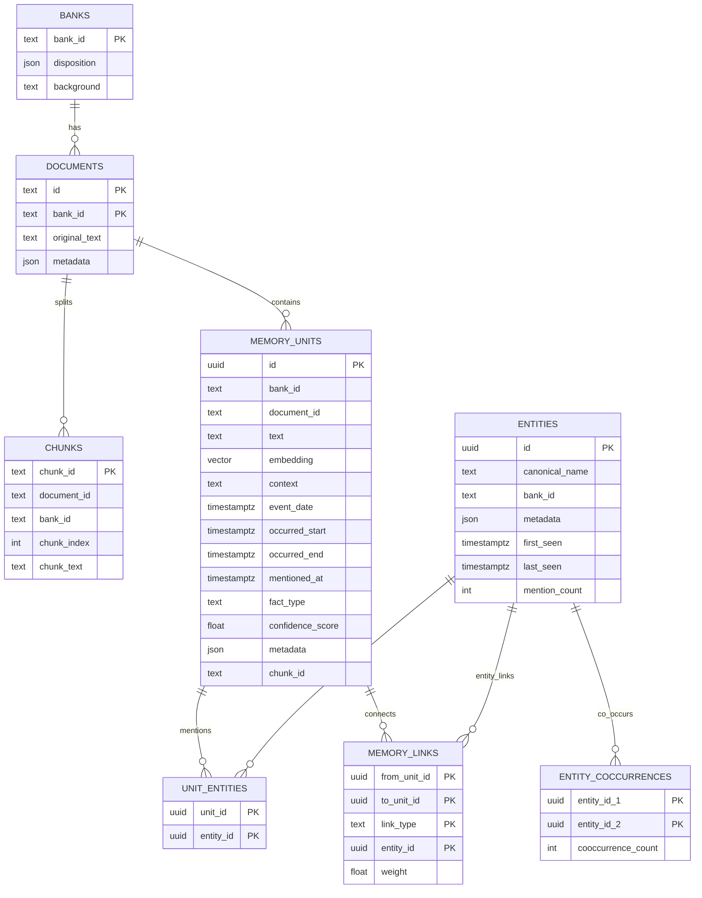
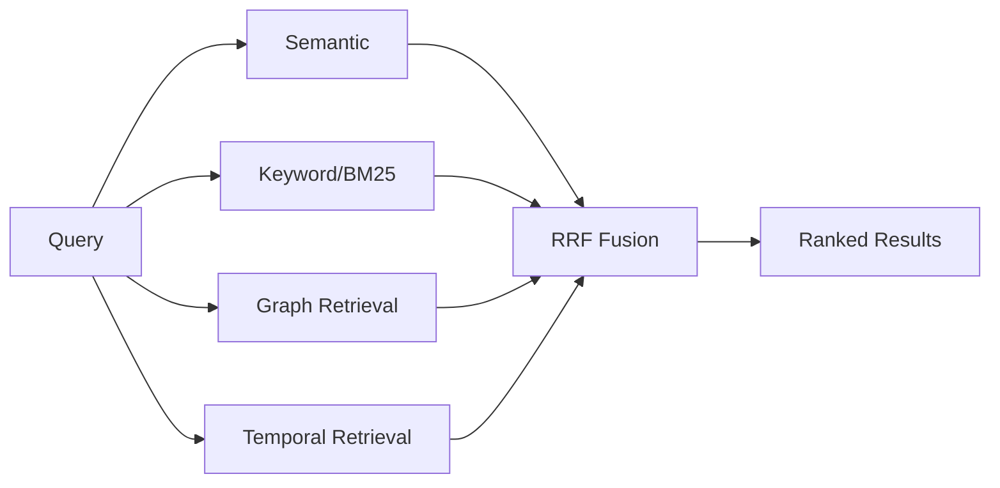
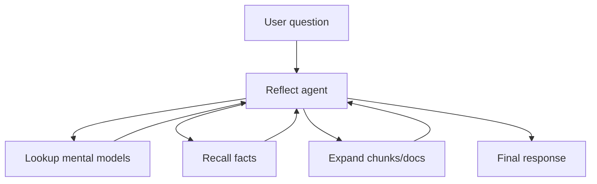
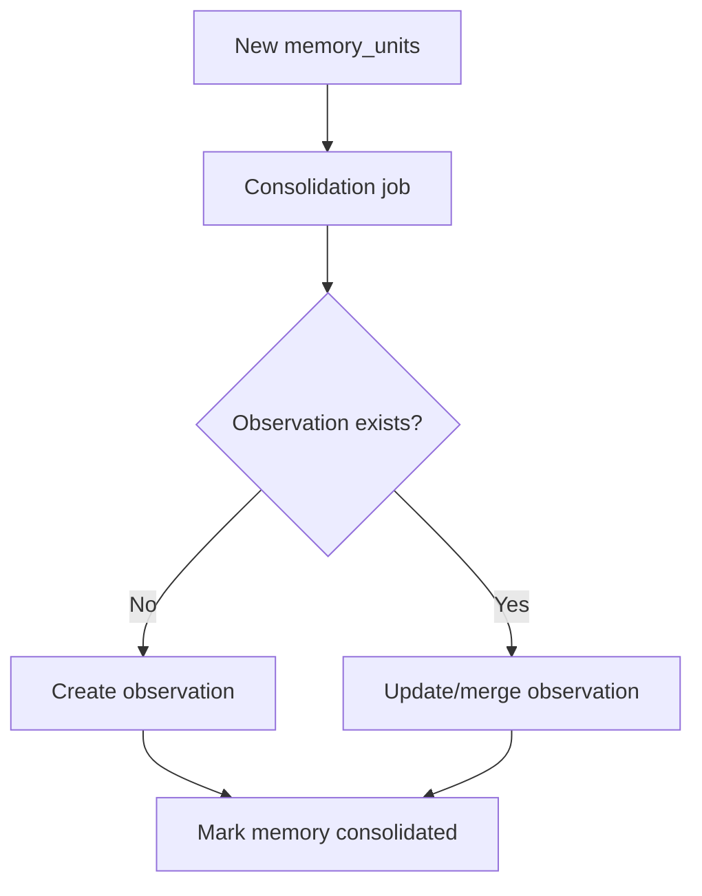

# Memory Architecture (Deep Dive)

This document explains how Hindsight’s memory system works end-to-end, including the
**data model**, **retain/recall/reflect flows**, and **background consolidation**.
It is meant to be a *complete* guide to the architecture, with diagrams, examples,
and practical usage advice for building against Hindsight’s memory engine.

---

## 1) Mental Model: What Hindsight Stores

At the core of Hindsight is a **memory bank**. A bank is an isolated memory store
containing documents, chunks, facts, entities, and links. Each fact is stored as a
**memory unit**, which is the smallest searchable unit in the system.

### 1.1 Memory Bank (Bank)
A bank is the “brain” for one agent or user. It stores:
- Bank-level settings and disposition (skepticism/literalism/empathy).
- The entire memory graph for that bank.

**Why it matters:** every call to `retain`, `recall`, or `reflect` is scoped to a bank ID,
so memory isolation is guaranteed.

### 1.2 Documents
Documents represent the original input content (e.g., a chat transcript or note).
Facts are extracted from these documents and preserved as memory units.

### 1.3 Chunks
Documents can be chunked. Each chunk is stored separately and linked to memory units.
Chunk IDs are generated as:

```
{bank_id}_{document_id}_{chunk_index}
```

Chunks allow Hindsight to surface the **raw surrounding text** of a fact when a user
requests expanded context.

### 1.4 Memory Units (Facts)
A **memory unit** is the canonical “fact” object. Each memory unit stores:
- The extracted fact text.
- Its fact type (`world`, `experience`, `observation`, and historically `opinion`).
- Timestamp fields (event date, occurred range, mentioned-at).
- Embedding vector for semantic search.
- Tags for visibility scoping.
- Links to its source document and chunk.

### 1.5 Entities and Links
Entities (people, orgs, places, etc.) are resolved and stored separately. Memory units
link to entities through a `unit_entities` table, while **memory links** connect facts
to each other by different relationship types:

- `temporal` (nearby in time)
- `semantic` (similar meaning)
- `entity` (shared entity)
- causal links such as `causes`, `caused_by`, `enables`, `prevents`

The result is a graph: memory units are nodes, and links are edges.

### 1.6 Observations (Consolidated Knowledge)
Observations are synthesized summaries of facts and stored **as memory units** with
`fact_type='observation'`. They include:
- `proof_count` (how many facts support the observation)
- `source_memory_ids` (the evidence set)
- `history` (JSON trace of changes)

Observations are produced by the **consolidation engine**, described later.

---

## 2) Data Model: Tables and Relationships

The schema is built for **PostgreSQL + pgvector** and organizes memory into a graph.
Key tables:



**Highlights from the codebase:**
- Memory units store embeddings, timestamps, fact types, and references to documents/chunks.
- Memory links allow multiple link types and weights.
- Entities are normalized, with co-occurrence statistics.

---

## 3) Retain Flow (Ingestion)

The **retain pipeline** is responsible for extracting facts and building the memory graph.
At a high level:

```mermaid
flowchart TD
    A[Raw content] --> B[Fact extraction (LLM)]
    B --> C[Chunking]
    B --> D[Embeddings]
    D --> E[Memory units]
    C --> F[Chunks table]
    E --> G[Deduplication]
    G --> H[Insert facts]
    H --> I[Entity processing]
    I --> J[Create links]
    J --> K[Temporal links]
    J --> L[Semantic links]
    J --> M[Entity links]
    J --> N[Causal links]
```

### 3.1 Step-by-step details
The retain orchestrator executes these steps in sequence:

1. **Fact extraction**: Each input content item is sent to the LLM to extract
   fact-level memory units and chunks.
2. **Embedding generation**: Each extracted fact is embedded for semantic search.
3. **Document tracking**: Documents are created/updated; chunks are stored and assigned
   IDs. Chunks link memory units back to their original source text.
4. **Deduplication**: Duplicate facts are detected before writing to the database.
5. **Insert facts**: Memory units are inserted into `memory_units`.
6. **Entity processing**: Entities are resolved and linked to units via `unit_entities`.
7. **Link creation**: Temporal, semantic, entity, and causal links are created.

### 3.2 Practical example: retain a chat transcript
Suppose you call `retain` with content:

```
"Alice moved to Berlin in 2022. She joined ExampleCorp last spring."
```

Resulting memory units might include:
- `Alice moved to Berlin in 2022` (experience/world fact)
- `Alice joined ExampleCorp last spring` (experience/world fact)

Entities:
- `Alice` (PERSON)
- `Berlin` (LOCATION)
- `ExampleCorp` (ORG)

Links:
- Temporal link between the two facts.
- Entity links to Alice.
- Semantic link if embeddings are similar.

---

## 4) Recall Flow (Search & Retrieval)

Recall uses a **parallel, multi-strategy retrieval pipeline** called TEMPR:



### 4.1 The four strategies
- **Semantic**: vector similarity against `memory_units.embedding`.
- **BM25 (keyword)**: full-text search across memory text.
- **Graph**: traversal across memory links to reach related facts.
- **Temporal**: time-aware expansion for questions like “last year” or “in June”.

Results are fused using **reciprocal rank fusion (RRF)**, optionally followed by
cross-encoder reranking.

### 4.2 Fact types in recall
Recall can filter results by fact type. Valid types include:
- `world`
- `experience`
- `observation`

### 4.3 Practical example: recall “Where does Alice work?”
1. Semantic + BM25 find facts mentioning Alice and ExampleCorp.
2. Graph retrieval expands via entity links.
3. Temporal retrieval boosts recent facts.
4. RRF merges results into a final ranked list.

The output includes memory units plus optional entity observations and raw chunk
text (if requested).

---

## 5) Reflect Flow (Reasoning with Memory)

Reflect is an **agentic reasoning loop** that uses tools to answer a question using
memories and higher-level knowledge.



### 5.1 Tool loop
The reflect agent can iteratively:
- **Search mental models**
- **Recall facts**
- **Expand** by retrieving raw document chunks

It continues until it has enough evidence to answer the query.

### 5.2 Disposition and mission
Bank-level disposition traits and mission text *shape* the response during reflect
(e.g., more skeptical vs more empathetic reasoning). These settings do **not**
impact recall results directly.

---

## 6) Consolidation (Observations)

After retention, Hindsight runs a **consolidation job** in the background.
This job:
- Scans newly inserted facts that have not been consolidated.
- Uses an LLM to synthesize or update observations.
- Writes observations back into `memory_units` with `fact_type='observation'`.



Observations maintain:
- Evidence tracking via `source_memory_ids`.
- Version history in `history`.

---

## 7) How Hindsight Uses the Memory Graph

Memory links are critical for advanced reasoning:

- **Entity links** connect facts that mention the same entity (person/org/etc).
- **Temporal links** enable questions like “What happened after X?”
- **Semantic links** allow “bridging” between semantically similar memories.
- **Causal links** provide cause/effect and enable chain reasoning.

This graph structure is what lets recall reach facts that are *related but not
textually similar*.

---

## 8) Usage Guides

### 8.1 Retain: Best Practices
- Provide clear, atomic statements for better fact extraction.
- Include timestamps (`event_date`) when available.
- Tag content for visibility scoping (multi-tenant or multi-user contexts).

### 8.2 Recall: Best Practices
- Use natural-language questions (semantic search excels here).
- Include time hints for temporal retrieval.
- Filter by fact types if you only want world facts or experience facts.

### 8.3 Reflect: Best Practices
- Provide a clear mission and disposition to guide reasoning style.
- Use reflect for multi-step reasoning; use recall for raw data retrieval.

---

## 9) End-to-End Example

**Scenario:** A personal assistant has been running for months.

1. **Retain** chat logs and notes daily.
2. **Consolidation** builds observations like “User prefers concise answers.”
3. **Recall** retrieves specific facts when asked about past events.
4. **Reflect** merges facts + observations for a high-quality response.

---

## 10) Architectural Summary

**Hindsight’s memory system is a graph-backed, multi-strategy retrieval engine** built
on PostgreSQL + pgvector. It combines:

- **Fact extraction + embeddings** (retain)
- **Parallel search** (semantic, BM25, graph, temporal)
- **Agentic reasoning** (reflect)
- **Background consolidation** (observations)

Together, these parts turn raw input into durable, structured memory that an
AI agent can query and reason over.
