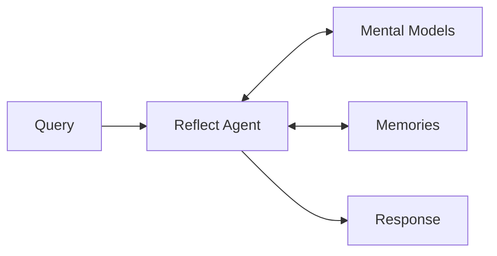

# Reflect: How Hindsight Reasons

When you call `reflect()`, Hindsight doesn't just retrieve facts — it **reasons** about them through the lens of mental models and disposition, generating contextual responses.



The reflect agent is **agentic**—it runs a reasoning loop, deciding which tools to use based on the query. It can explore mental models, search memories, drill into documents, or create new mental models when it discovers important patterns.

---

## Why reflect?

Hindsight provides two ways to query memories: `recall()` returns raw facts, while `reflect()` reasons about them.

### recall() vs reflect()

**recall()** is a retrieval operation. It returns ranked facts matching your query—you get raw data and build your own reasoning on top.

**reflect()** is a reasoning operation. It runs an agentic loop that:
- Explores **mental models** for structured understanding of key topics
- Searches **memories** for specific evidence
- **Learns** by creating new mental models when it discovers important patterns
- Reasons through evidence to form grounded responses

The key difference: recall gives you facts, reflect gives you understanding. When the agent reasons, it draws on everything the bank has learned—not just matching facts, but synthesized knowledge about people, projects, and concepts.

### When to use reflect

| Use `recall()` when... | Use `reflect()` when... |
|------------------------|-------------------------|
| You need raw facts | You need reasoned interpretation |
| You're building your own reasoning | You want the bank to "think" for itself |
| You need maximum control | Forming recommendations or judgments |
| Simple fact lookup | Complex questions requiring synthesis |

**Example:**
- `recall("Alice")` → Returns all Alice facts
- `reflect("Should we hire Alice?")` → Reasons about Alice's fit based on accumulated knowledge and mental models

---

## Mental models

When a bank has a mission set, mental models provide structured knowledge that the reflect agent can draw on. A **mission** is a natural language description of what the agent is for:

```python
client.set_mission(
    bank_id="pm-agent",
    mission="Be a PM for the engineering team, tracking sprint progress, team capacity, and technical decisions"
)
```

The mission tells the agent what topics are important and what kind of mental models to build. Mental models are then created automatically (structural and emergent) or manually (pinned and directive).

**Note:** A mission is required to use mental models, but mental models are optional for reflect. Without a mission, the agent reasons over raw memories.

### Available tools

During reflect, the agent has access to:

| Tool | Purpose |
|------|---------|
| `list_mental_models()` | See available mental models |
| `get_mental_model(id)` | Read observations and evidence |
| `recall(query)` | Search raw memories |
| `expand(memory_ids)` | Load full document context |
| `learn(name, description)` | Create a new mental model to track a pattern |

The agent decides how deep to go based on the query—simple questions may only need mental model summaries, while complex decisions may require drilling down to source documents.

### Creating learned mental models

If the agent discovers an important pattern during reasoning, it can create a "learned" mental model to track it going forward:

> User: "What are customers saying about our new pricing?"
>
> Agent thinks: "I found scattered feedback about pricing across many memories. This seems like something I should track systematically."
>
> Agent creates: Mental model "Pricing Feedback" for future tracking

See [Mental Models](./mental-models) for more on types, observations, and refresh.

---

## Disposition

Disposition configures the bank's character—how it interprets information during reflect. Three traits shape reasoning:

| Trait | Scale | Low (1) | High (5) |
|-------|-------|---------|----------|
| **Skepticism** | 1-5 | Trusting, accepts information at face value | Skeptical, questions and doubts claims |
| **Literalism** | 1-5 | Flexible interpretation, reads between the lines | Literal interpretation, takes things at face value |
| **Empathy** | 1-5 | Detached, focuses on facts | Empathetic, considers emotional context |

```python
client.update_disposition(
    bank_id="my-bank",
    disposition={
        "skepticism": 4,   # Questions claims
        "literalism": 4,   # Focuses on concrete specs
        "empathy": 2       # Prioritizes technical facts
    }
)
```

### Same facts, different conclusions

Two banks with different dispositions, given identical facts about remote work:

**Bank A** (low skepticism, high empathy):
> "Remote work enables flexibility and work-life balance. The team seems happier and more productive when they can choose their environment."

**Bank B** (high skepticism, low empathy):
> "Remote work claims need verification. What are the actual productivity metrics? The anecdotal benefits may not translate to measurable outcomes."

**Same facts → Different conclusions** because disposition shapes interpretation.

### Presets by use case

| Use Case | Recommended Traits | Why |
|----------|-------------------|-----|
| **Customer Support** | skepticism: 2, literalism: 2, empathy: 5 | Trusting, flexible, understanding |
| **Code Review** | skepticism: 4, literalism: 5, empathy: 2 | Questions assumptions, precise, direct |
| **Legal Analysis** | skepticism: 5, literalism: 5, empathy: 2 | Highly skeptical, exact interpretation |
| **Therapist/Coach** | skepticism: 2, literalism: 2, empathy: 5 | Supportive, reads between lines |
| **Research Assistant** | skepticism: 4, literalism: 3, empathy: 3 | Questions claims, balanced interpretation |

---

## What you get from reflect

When you call `reflect()`:

**Returns:**
- **Response text** — Reasoned answer informed by mental models and disposition
- **Based on** — Which memories and mental models were used

**Example:**
```json
{
  "text": "Based on Alice's ML expertise and her work at Google, she'd be an excellent fit for the research team lead position...",
  "based_on": {
    "world": [
      {"text": "Alice works at Google...", "weight": 0.95},
      {"text": "Alice specializes in ML...", "weight": 0.88}
    ],
    "mental_models": [
      {"id": "alice", "name": "Alice"}
    ]
  }
}
```

---

## Next steps

- [**Mental Models**](./mental-models) — How structured knowledge is organized
- [**Retain**](./retain) — How rich facts are stored
- [**Recall**](./retrieval) — How multi-strategy search works
- [**Reflect API**](./api/reflect) — Code examples, parameters, and tag filtering
